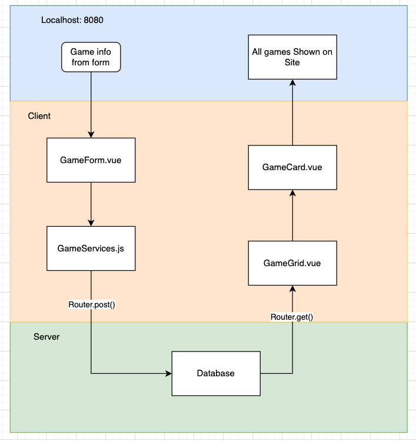

1. What is responsible for defining the routes of the `games` resource?

the gamesRouter in server.js

2. What do you notice about the folder structure?  Whats the client responsible for? Whats the server responsible for?

The client folder is responsible for the front end and th server acts as a middle man between the database and the client folder

3. What are the the responsibilities of server.js?

To send querries to the database

4. What are the responsibilities of the `gamesRouter`?

The games router sends GET,PUT, DELETE and POST requests to the database

5. What process does the the client (front-end) use to communicate with the server?

The clinet uses http://localhost:3000/api/games/ and methods to comunicate what it wants the server to do with the database

6. What optional second argument does the `fetch` method take? And what is it used for in this application? Hint: See [Using Fetch](https://developer.mozilla.org/en-US/docs/Web/API/Fetch_API/Using_Fetch) on the MDN docs

the fetch method can also take an ID. the can be used to update, remove or just select the obect with the matching ID

7. Which of the games API routes does the front-end application consume (i.e. make requests to)?

GameServices.js only has methods for GET(all), POST and DELETE(one)

8. What are we using the [MongoDB Driver](http://mongodb.github.io/node-mongodb-native/) for?

MongoDB Driver allows us to to use mongodb with node.js